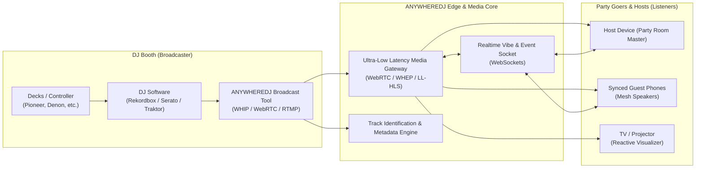

# ANYWHEREDJ

> **Stream live DJ sets directly to any party, anywhere in the world.**

ANYWHEREDJ is a live audio-first streaming platform built specifically for DJs, party hosts, and dance music fans. It bridges the gap between bedroom/club DJ booths and house parties, afterparties, road trips, and social gatherings worldwide.

---

## 1. Executive Summary & Problem Statement

### The Problem
* **Generic Platforms Fail DJs:** Platforms like Twitch, YouTube, and TikTok aggressively mute or strike streams due to automated DMCA systems, degrade audio quality with heavy speech-optimized compression, and demand high-bandwidth video that party speakers don't need.
* **Static Playlists Kill Party Energy:** Standard Spotify/Apple Music playlists lack the dynamic crowd-reading, seamless transitions, and spontaneous energy of a real live DJ.
* **DJ Monetization is Broken:** Underground and bedroom DJs have few avenues to broadcast high-fidelity sets and directly monetize their craft through digital tips and community patronage.
* **Multi-Device Sound is Fragmented:** House parties often struggle with multi-speaker coverage across rooms without expensive hardware setups.

### The Solution: ANYWHEREDJ
A dedicated, low-latency, audio-first platform featuring:
* **Studio-Grade Audio:** Uncompressed/high-bitrate stereo (up to 320kbps Opus/AAC).
* **"Party Mode" Multi-Speaker Sync:** Synchronized audio playback across multiple phones and Bluetooth speakers in the same room.
* **Interactive Dancefloor:** Real-time crowd vibe feedback, virtual tipping ("Buy the DJ a Drink"), and live poll-based crowd curation.
* **Automated Track IDs:** Real-time track recognition and integration with Spotify/Apple Music.

---

## 2. Platform Architecture & Experience

---

## 3. Core Pillars & Feature Breakdown

### A. The Party Goer & Host Experience
* **Party Mode (Synced Multi-Speaker Mesh):**
  * Uses clock synchronization (NTP-style drift correction over WebSockets + Web Audio API) to sync multiple smartphones playing through Bluetooth speakers across an apartment or outdoor party.
* **Interactive Dancefloor & Vibe Meter:**
  * **Hype Gauge:** Crowd taps, screen shakes, or phone motion send real-time energy pulses to the DJ booth.
  * **Virtual Tipping ("Buy a Drink"):** Listeners send micro-transactions with custom animations (e.g. sending a virtual shot, cocktail, or smoke blast).
  * **Crowd Polls / Vibe Voting:** DJs can drop quick real-time binary prompts (e.g., *"Drop Techno or stay Tech-House?"*, *"Push tempo to 135 BPM?"*).
* **Audio-Reactive TV / Visualizer Mode:**
  * Cast full-screen reactive visualizers and live track IDs to a smart TV or projector, turning any living room into an audiovisual club room.
* **Instant Track Saving:**
  * One-tap save for currently playing tracks directly to personal Spotify, Apple Music, or Beatport playlists.

### B. The DJ Booth Experience
* **Audio-First Ingest:**
  * Stream pristine stereo audio directly from line-in, audio interface, virtual soundcard, or OBS via WHIP/WebRTC or RTMP.
  * Video is optional (multi-cam support for deck view + room view, or audio-only with custom motion graphics).
* **Metadata & Track Scrobbling:**
  * Direct integration with Serato/Traktor/VirtualDJ history logs, Pioneer Rekordbox export, or live audio fingerprinting (ACRCloud/Shazam) to broadcast track titles live.
* **Live DJ HUD & Feedback:**
  * Real-time listener count, geographical listeners map, vibe intensity graphs, and tip alerts displayed on an iPad or secondary monitor.

### C. Discovery & Community
* **"Live Tonight" Global & Local Radar:**
  * Interactive radar map showing live sets: from club residents in Berlin and rooftop sunsets in Ibiza to bedroom producers streaming locally.
* **Curated Vibe Filters:**
  * Filter sets by mood and phase of the night: *Pre-game / Warm-up*, *Peak Time*, *Afterhours*, *Chillout / Sunday Session*.
* **Archived Sets & Recordings:**
  * DJs can archive sets with timestamped tracklists for on-demand playback, re-listening, and podcast syndication.

---

## 4. Technical Architecture

| Layer | Technology Options | Key Responsibility |
| :--- | :--- | :--- |
| **Broadcaster Ingest** | WebRTC (WHIP), RTMP, SRT | Sub-second audio/video stream ingest from DJ hardware/software. |
| **Media Distribution** | LiveKit / Mediasoup / Cloudflare Stream / WHEP | Low-latency audio delivery across distributed edge CDNs. |
| **Audio Processing** | Web Audio API, Opus Codec (128–320 kbps) | Hi-fi stereo processing, volume normalization, and phase alignment. |
| **Clock Synchronization** | WebSockets + NTP time-drift sync algorithm | Synchronizing multi-device playback within millisecond tolerances. |
| **Track Recognition** | ACRCloud / Shazam API / Serato Live Playlist parser | Automated real-time track identification and metadata broadcasting. |
| **Real-Time Data & Chat** | WebSockets / Redis PubSub | Live tipping events, vibe meter telemetry, and room chat. |
| **Frontend Clients** | React / Next.js, React Native (iOS & Android) | Responsive web and native mobile apps with background audio support. |

---

## 5. Music Rights, Licensing & Copyright Strategy

Music copyright is the primary reason why existing platforms struggle with DJ sets:
1. **Statutory Webcasting Licenses (Mixcloud Model):**
   * Partnering with Performance Rights Organizations (ASCAP, BMI, SESAC, SoundExchange in the US; PRS, PPL, GEMA in Europe).
   * DJs submit tracklists (or automated fingerprinting generates them) for proper royalty distribution to artists and labels.
2. **"Whitelisted" Label & Producer Channels:**
   * Direct partnerships with indie electronic labels (e.g., Defected, Anjunabeats, Spinnin') allowing pre-cleared live promotional broadcasting.
3. **Private Party Rooms:**
   * Unlisted/private password-protected sessions for private gatherings, mitigating public broadcasting liability while testing features.

---

## 6. Business & Monetization Model

1. **Party Economy (Micro-tips & Tokens):**
   * Digital currency for tipping DJs ("Buy a Shot", "Fire Blast" overlays). Platform retains a 10%–20% transaction fee.
2. **Ticketing & Digital Guestlists:**
   * Exclusive access tickets for VIP streams, festival backstages, or famous DJ afterparties.
3. **ANYWHEREDJ Pro for DJs (Subscription SaaS):**
   * High-bitrate lossless audio, unlisted private streams, deep crowd analytics, automated setlist archiving, and custom branding for $15–$30/month.
4. **Hardware & Brand Partnerships:**
   * Partnerships with speaker manufacturers (JBL, Sonos, Ultimate Ears) and beverage/lifestyle brands for sponsored stages and virtual events.

---

## 7. MVP Roadmap

### Phase 1: Core Audio & Web Broadcast (Proof of Concept)
- [ ] Lightweight web broadcaster: Direct line-in audio streaming via WebRTC/WHIP.
- [ ] Clean, mobile-friendly audio player with low-latency listening.
- [ ] Real-time listener chat and basic "Vibe Tap" button.
- [ ] Manual or automated track ID display.

### Phase 2: Party Mode & Synchronization
- [ ] Room code generation for hosts (`anywheredj.com/room/<code-or-slug>`).
- [ ] Clock sync protocol for multi-device synchronized audio playback.
- [ ] Visualizer mode with cast support (Chromecast / AirPlay / TV browser).

### Phase 3: DJ Tools & Monetization
- [ ] Integration with DJ software track histories (Serato/Rekordbox).
- [ ] Virtual tipping engine via Stripe / crypto micro-transactions.
- [ ] DJ profile pages, schedule announcements, and set archiving.
