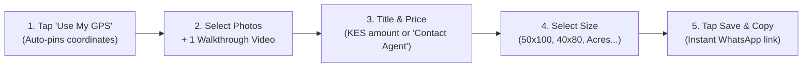
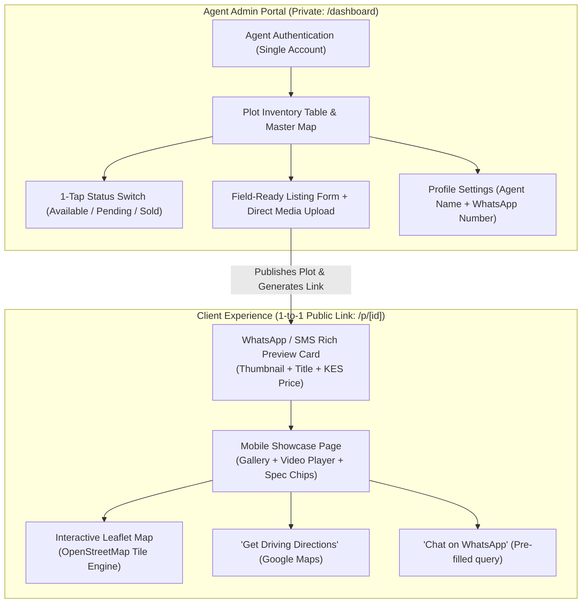
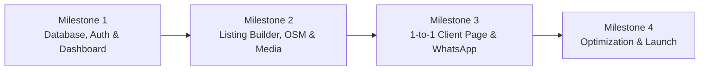

# Master Product Specification: LandSales Web App (MVP)

> **Document Version:** 1.0  
> **Status:** Approved for Implementation  
> **Target User:** Independent Land / Plot Sales Agent (Single-Agent Scope)  
> **Primary Region:** Kenya / East Africa (Currency: KES | Local Plot Metrics)  

---

## 1. Executive Summary & Core Purpose

Selling land is fundamentally different from selling built houses or apartments. Vacant plots have **no street numbers**, require **exact GPS coordinates** for client site visits, and depend heavily on **visual proof of terrain and road access**.

Currently, land sales agents waste hours every week:
1. Explaining complex driving directions over the phone to lost buyers.
2. Digging through personal phone camera rolls to find and re-upload 15 heavy photos and 50MB videos on WhatsApp.
3. Manually retyping the same plot specifications (size, water, power, price) dozens of times.
4. Dealing with confusion when clients inquire about plots that were already sold or reserved.

**The Solution:** A lightweight, mobile-first web app that allows the salesperson to log a plot in the field in **under 60 seconds** (auto-capturing GPS coordinates, photos, and video), instantly manage plot status (`Available`, `Pending`, `Sold`), and send a **single, branded 1-to-1 link** that buyers can view without downloading an app or logging in.

---

## 2. Core Agent Pain Points & Solutions

| Agent Problem | Solution in This App |
| :--- | :--- |
| **Lost Clients & Vague Directions** Plots lack street addresses. Explaining landmarks (*"turn after the blue church"*) fails constantly. | **1-Tap GPS Navigation Button** The client page features a prominent *"Get Driving Directions"* button that opens Google Maps, Apple Maps, or Waze with direct route navigation to the plot. |
| **Clogged Phone Memory & Slow Uploads** Uploading 15 photos + video to every buyer burns mobile data and clutters the client's phone. | **1 Lightweight Shareable Link** The agent taps *"Copy Link"* and sends it. The buyer views high-res photos and streams video directly in their browser. |
| **Repetitive Specification Queries** Answering *"How big is it? Is there power? What's the price?"* 40 times a day. | **Scannable "At-a-Glance" Spec Chips** Prominent badges for Plot Size (`50 × 100 ft`), Price (`KSh 1,500,000`), Road Access, Electricity, and Water. |
| **"Which plot are you asking about?"** Buyers text: *"Is this available?"* The agent has 12 plots and doesn't know which one they mean. | **Pre-Filled WhatsApp Inquire Button** Client taps *"Inquire on WhatsApp"*, automatically filling: `"Hi, I'm inquiring about Plot 4B - Malaa Ridge (KSh 1,500,000)"`. |
| **Outdated Photos & Status Embarrassment** WhatsApp forwarded photos circulate indefinitely, causing leads to request plots that are already sold. | **Real-Time Live Status Switch** Toggling a plot to `Pending` or `Sold` updates the live link instantly. No awkward backtracking. |

---

## 3. The 60-Second In-The-Field Workflow

Designed for quick field data entry under direct sunlight with minimal typing:

---

## 4. System Architecture & Tech Stack

### Technology Stack:
* **Frontend Framework:** **Next.js (App Router)** with React and **Tailwind CSS**.
* **Mapping Engine:** **Leaflet.js** with **OpenStreetMap** (100% open-source, mobile-touch optimized, zero Google API fees).
* **Media Storage:** Cloud Object Storage (Supabase Storage / Cloudflare R2 / AWS S3) for direct video and photo uploads.
* **Database:** Relational Database (PostgreSQL via Supabase, or SQLite for ultra-lightweight deployment).
* **Link Preview:** Next.js Dynamic Metadata (`generateMetadata`) for Open Graph cards on WhatsApp/iMessage/SMS.

### 4.1 Mobile-First & Apple Design System (iOS HIG Guidelines)
The application is engineered primarily for iPhone / mobile field use adhering to Apple Human Interface Guidelines (HIG):
1. **iOS Safe Area Compliance:** Full support for iPhone Dynamic Island, camera notch, and bottom Home Indicator bar using `viewport-fit=cover`, `env(safe-area-inset-top)`, and `env(safe-area-inset-bottom)`.
2. **Touch Targets:** Strict minimum of **44 × 44 pt** touch target size on all buttons, tabs, map controls, and action triggers.
3. **Typography & System Fonts:** Native iOS system font hierarchy (`-apple-system, BlinkMacSystemFont, "SF Pro Text", "SF Pro Display", system-ui`), ensuring crisp text legibility in outdoor sunlight.
4. **iOS Form Controls & Safari Optimization:**
   * All form inputs use a minimum `font-size: 16px` to completely eliminate the disruptive iOS Safari automatic viewport zoom on input focus.
   * Proper `inputmode` configuration: `inputmode="numeric"` for KES price, `inputmode="tel"` for phone numbers, displaying the native iOS number pad directly.
   * `touch-action: manipulation` applied to buttons to remove 300ms mobile tap delays.
5. **Apple Aesthetic & Visual Polish:**
   * Translucent navigation headers and floating action bars with iOS backdrop blur (`backdrop-blur-xl bg-white/80` or `bg-slate-900/80`).
   * Continuous squircle curvature on cards and media containers (`rounded-2xl` / `rounded-3xl`).
   * Bottom sheet modals / drawers for mobile filters and actions instead of rigid desktop popups.
   * Momentum scrolling enabled (`-webkit-overflow-scrolling: touch`).
6. **PWA & iOS Home Screen Integration:**
   * Web App manifest with `apple-mobile-web-app-capable: yes` and `apple-mobile-web-app-status-bar-style: default`.
   * High-resolution Apple Touch Icons for home screen installation.

---

## 5. Detailed Feature Specifications

### Module 1: Agent Dashboard (`/dashboard`)
1. **Security & Authentication:**
   * **Primary Mobile Login: Google OAuth 2.0** — Fast, 1-tap mobile sign-in without remembering or typing passwords on an iPhone keyboard.
   * **Secondary / Fallback: Email & Password** — Traditional credential login with secure hash (Argon2/bcrypt) for non-Google accounts or network restrictions.
   * **Single-Agent Allowlist Protection:** Access is locked to the specific agent's verified email address (`ALLOWED_AGENT_EMAIL`). Any third-party attempting to log in via Google receives a clean "Access Restricted" notice, eliminating unauthorized signups without requiring complex RBAC tables.
   * **Persistent Mobile Sessions:** Long-lived secure sessions (JWT in HTTP-only, secure cookies) so the agent stays signed in when reopening Safari from the iPhone home screen.
2. **KPI Counters:**
   * Total Plots
   * Available (🟢 Green)
   * Pending / Under Offer (🟠 Orange)
   * Sold (🔴 Red)
3. **Inventory Management:**
   * Search filter by plot title or reference name.
   * Status filter buttons (`All`, `Available`, `Pending`, `Sold`).
   * Quick action: **"Copy Share Link"** (copies `https://domain.com/p/[id]` to clipboard).
   * Quick action: Status toggle dropdown (instantly update from Available to Pending/Sold).
   * Edit / Delete controls with confirmation prompt.
4. **Master Map View:** Toggle from card view to a full-screen OpenStreetMap showing all plots as color-coded pins.

### Module 2: Field Listing Builder (`/dashboard/plots/new` & `edit`)
1. **Property Basics:**
   * **Title / Identifier:** e.g., *"Plot 12 - Kangundo Road"*, *"5-Acre Kilifi Parcel"*.
   * **Price Configuration:**
     * Mode A: Numeric Price in **Kenyan Shillings (KES)** with auto-formatted commas (e.g., `KSh 1,500,000`).
     * Mode B: Toggle **"Contact Agent for Price"** (hides numerical value and displays an inquiry badge).
   * **Size / Dimensions Selector:** Dropdown with quick presets:
     * `50 × 100 ft` (1/8 Acre)
     * `40 × 80 ft`
     * `100 × 100 ft` (1/4 Acre)
     * `Acres` (numeric input, e.g. 0.5, 2, 5)
     * `Hectares (Ha)`
     * `Square Meters (sq m)`
     * `Custom Dimension` (freeform text input)
   * **Zoning / Land Use:** Residential, Commercial, Agricultural, Mixed-Use.
   * **Quick Spec Chips (Checkboxes):**
     * Road Access: *Tarmac, All-weather gravel, Dirt road*
     * Electricity: *On site, Within 200m, Off-grid*
     * Water: *Borehole, Piped county water, Seasonal stream*
   * **Description / Highlights:** Multi-line text field for key selling points.
2. **Direct Media Uploads:**
   * **Photos:** Multi-file image picker with thumbnail previews, drag-to-reorder, and delete buttons. Images are compressed client-side before upload to preserve mobile bandwidth.
   * **Video:** Direct phone video upload (MP4/MOV) with progress bar and inline video player preview.
3. **OpenStreetMap Pin Placement:**
   * **"📍 Use My Current GPS"** button: Automatically queries mobile browser geolocation and drops the pin at the agent's exact physical coordinates.
   * **Manual Map Click / Drag:** Tap anywhere on the Leaflet map to adjust or fine-tune pin position.
   * Readout display of Latitude and Longitude.

### Module 3: Public 1-to-1 Client Showcase (`/p/[id]`)
1. **Access:** Publicly accessible via direct URL. No authentication, app download, or registration required for the buyer.
2. **Visual Header & Status:**
   * Prominent status badge: `🟢 Available`, `🟠 Pending / Under Offer`, or `🔴 Sold`.
   * Title and formatted KES price (or *"Contact Agent for Details"* badge).
3. **Media Carousel & Player:**
   * Full-width responsive photo slider with fullscreen lightbox.
   * Native HTML5 video player for walkthrough/drone video.
4. **Quick-Specs Grid:** Visual chips showing Plot Size, Zoning, Road Access, Water, and Power.
5. **Interactive OpenStreetMap:**
   * Embedded Leaflet map centered on the plot's pin.
   * Prominent button: **"🧭 Get Driving Directions"** (opens native navigation in Google Maps / Apple Maps / Waze).
6. **Primary Conversion Action (WhatsApp CTA):**
   * Floating/sticky button: **"💬 Inquire on WhatsApp"**.
   * Routes to the agent's configured phone number with a pre-filled message:
     > *"Hi! I'm inquiring about [Plot Title] listed for [Price / Price on Request]. Is it still available?"*

### Module 4: Social Sharing & WhatsApp Preview Cards (Open Graph)
* When the agent sends the link `domain.com/p/plot-4b` via WhatsApp or SMS, the link automatically unfolds with:
  * **Image:** First uploaded plot photo.
  * **Title:** `Plot Title — KSh 1,500,000 (Available)`
  * **Description:** Size and location highlights.

### Module 5: Agent Profile Settings (`/dashboard/settings`)
* **Agent Name:** Displayed on client pages.
* **WhatsApp Phone Number:** Formatted with international dialing code (e.g., `+254 712 345678`).
* **Default Inquiry Message Template:** Allows customizing the text pre-filled in the buyer's WhatsApp message.

---

## 6. Data Schema

### Table: `plots`
| Column | Type | Constraints / Details |
| :--- | :--- | :--- |
| `id` | UUID / String | Primary Key (used in `/p/[id]` URL) |
| `title` | String (255) | Required (e.g. "Plot 4B - Green Valley") |
| `status` | Enum | `AVAILABLE`, `PENDING`, `SOLD` (Default: `AVAILABLE`) |
| `price_type` | Enum | `FIXED`, `CONTACT_AGENT` |
| `price_kes` | BigInt / Numeric | Nullable if `price_type == CONTACT_AGENT` |
| `size_preset` | Enum | `50x100`, `40x80`, `100x100`, `ACRES`, `HECTARES`, `SQM`, `CUSTOM` |
| `size_custom_value` | String (100) | Value or acreage quantity (e.g., "0.5", "2.5", "100x150") |
| `zoning` | String (100) | Residential, Agricultural, Commercial, Mixed |
| `road_access` | String (100) | Tarmac, Gravel, Dirt, None |
| `water_source` | String (100) | Piped, Borehole, None |
| `electricity` | String (100) | On-site, Nearby, Off-grid |
| `description` | Text | Freeform agent notes / property pitch |
| `latitude` | Float (10, 7) | Required (e.g., -1.2921) |
| `longitude` | Float (10, 7) | Required (e.g., 36.8219) |
| `photos` | JSON / Array | List of image URLs in display order |
| `video_url` | String (500) | Direct video file URL (Nullable) |
| `created_at` | Timestamp | Auto-generated timestamp |
| `updated_at` | Timestamp | Auto-updated timestamp |

### Table: `agent_profile`
| Column | Type | Details |
| :--- | :--- | :--- |
| `id` | UUID / String | Primary Key |
| `agent_name` | String (100) | Agent display name |
| `whatsapp_number` | String (20) | e.g. "+254712345678" |
| `custom_greeting` | Text | Optional default message template |

---

## 7. Implementation Milestones

* **Milestone 1: Project Setup, Database & Agent Dashboard**
  * Initialize Next.js project with Tailwind CSS.
  * Setup database tables (`plots`, `agent_profile`) and authentication.
  * Build dashboard UI with KPI counters and inventory list with quick status toggles.
* **Milestone 2: Field Listing Form, Media Engine & OpenStreetMap**
  * Build plot creation/edit form with KES formatting and measurement presets.
  * Integrate Leaflet.js with OpenStreetMap and *"Use My Current GPS"* button.
  * Implement direct image and video uploads with preview.
* **Milestone 3: 1-to-1 Client Showcase & Social Sharing**
  * Build `/p/[id]` public showcase page with mobile photo carousel and video player.
  * Embed Leaflet map with *"Get Driving Directions"* button.
  * Implement Open Graph dynamic preview cards for WhatsApp sharing.
  * Wire up pre-formatted WhatsApp chat inquiry trigger.
* **Milestone 4: Polish, Mobile Testing & Deployment**
  * Test on mobile devices (camera capture, GPS accuracy, slow network simulation).
  * Deploy to production environment with cloud storage configured.

---

## 8. Explicit Scope Boundaries (Deferred to Phase 2)

To maintain extreme speed and simplicity for the agent, the following are intentionally deferred:
1. **Public Marketplace / Search Directory:** A public homepage where random visitors search listings.
2. **Boundary Polygon Drawing:** Plot perimeter polygon outlines (MVP relies on high-accuracy pin + GPS).
3. **Multi-Agent / Team Permissions:** Multiple agent accounts under a broker.
4. **Online Payment Processing:** In-app deposits or credit card checkouts.
